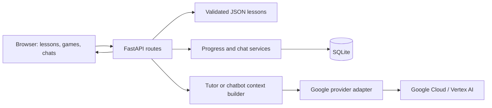

# Technical architecture

## Stack choice

Use a **Python FastAPI application** that serves **Jinja HTML templates**, native CSS, and small JavaScript modules. SQLite holds single-learner local state. JSON files hold lessons. This is a project design choice: it lets the learner follow one Python request path without learning React and a separate Node backend simultaneously. FastAPI supports this template arrangement through its documented template utilities. [FastAPI templates](https://fastapi.tiangolo.com/advanced/templates/).

Use the **Google Gen AI Python SDK (`google-genai`)** behind a provider adapter. Its documented surface includes text generation, streaming, and token counting. Keep model and auth settings configurable; verify the selected model and SDK version at implementation time. [SDK documentation](https://googleapis.github.io/python-genai/).

Target a supported Python version compatible with the pinned dependencies; verify the learner's installed version before setup. Use a virtual environment, pinned application dependencies, and Python's standard SQLite interface for M1. Add pytest and a browser testing tool when meaningful app behavior exists.

## Request flow



The browser never calls Google with a reusable credential. The backend loads the current lesson by ID and version, validates the request, builds bounded context, and calls the adapter. It returns sanitized app-level data, not raw SDK objects.

## Planned application layout

```text
app/
  main.py                  # App startup, routes, static files
  config.py                # Server environment and limits
  models.py                # Typed request/response contracts
  db.py                    # Connections and schema migrations
  services/
    content.py             # Validated lessons and course map
    progress.py            # Attempts, completion, XP ledger
    chat.py                # Conversation context and persistence
    tutor.py               # Lesson-aware tutor instructions
    usage.py               # Quotas, usage reservation and reconciliation
  providers/
    base.py                # Provider interface
    demo.py                # Explicit deterministic demo
    google_cloud.py        # SDK and auth adapter
  templates/               # Home, lesson, workshop, chat, settings
  static/css/
  static/js/               # Games, quiz, chat stream, tutor drawer
content/                   # Existing course and lesson files
data/                      # Ignored local SQLite and backups
tests/                     # Added with implementation
tools/                     # Content rendering and validation
```

M1 is implemented with a deliberately smaller layout: `app/main.py`, `config.py`, `models.py`, `content.py`, `progress.py`, `db.py`, and `demo.py`, plus templates and static assets. M2 adds `ai.py` for context, policy, and usage, and `providers.py` for the Google SDK. M3 adds `chat.py` for saved turns, persona/context selection, streaming workers, and recovery; it reuses the existing database and AI reservation policy.

## App API contract

| Route | Purpose | Milestone |
| --- | --- | --- |
| `GET /` | Home and continue action | M1 |
| `GET /lessons/{id}` | Lesson page | M1 |
| `GET /api/course` | Course map and availability | M1 |
| `GET /api/lessons/{id}` | Validated lesson content/version | M1 |
| `POST /api/attempts` | Score authored game/quiz answers on server | M1 |
| `POST /api/lessons/{id}/acknowledgments` | Read/build self-reports | M1 |
| `GET /api/progress` | Completion and XP summary | M1 |
| `POST /api/journal` | Save learner reflection | M1 |
| `GET /api/provider/status` | Masked configuration status; no network call | M2 |
| `POST /api/provider/test` | Explicit bounded connection test | M2 |
| `POST /api/tutor/messages` | Complete lesson-aware single-turn response | M2 |
| `POST /api/ai/messages` | Complete single-turn chatbot response | M2 |
| `POST /api/chats` | Create saved Demo or Google conversation | M3 |
| `GET /api/chats` | List active/archived chats by mode | M3 |
| `POST /api/chats/{id}/messages` | Persist turn and start/recover generation by request ID | M3 |
| `GET /api/chats/{id}` | Saved messages and statuses | M3 |
| `POST /api/generations/{id}/cancel` | Request cancellation | M3 |
| `POST /api/chats/{id}/settings` | Save title and persona for future requests | M3 |
| `POST /api/chats/{id}/archive`, `/restore` | Reversible local archive | M3 |
| `POST /api/chats/{id}/context` | Preview draft and selected context | M3 |
| `POST /api/chats/{id}/turns/{turn}/retry`, `/select` | Explicit latest-turn variants/selection | M3 |
| `GET /api/generations/{id}`, `/events` | Saved status or reconnectable SSE snapshots | M3 |
| `POST /api/course/drafts` | Structured content proposal | Later |
| `POST /api/course/drafts/{id}/publish` | Publish validated draft | Later |

`POST /api/tutor/messages` accepts lesson ID/version, mode, message, and request_id. M2 is single-turn; no history is sent. It does not accept client-supplied system instructions or authoritative lesson bodies. On version mismatch, load the selected known version or return a refresh-required error.

`POST /api/attempts` accepts lesson/version, activity ID, round-to-choice mapping, and an idempotency key. Validate answer references, calculate score, and commit attempt plus any first-time XP award in one transaction. Client-provided scores are ignored.

## M2 persistence

Schema version 2 appends `ai_requests` (attempt ID, payload hash, purpose, lesson ID, status, timestamp, calls attempted, returned usage, cached response, redacted error code). Existing progress, XP, and journals are untouched. One local server process is supported. On restart, running attempts become interrupted without automatic reruns. The request ledger is not selected conversation history.

## M3 persistence

Schema version 3 appends `chats` (mode, title, predefined persona, archive flag), `chat_turns` (user text and selected generation ID), and `generations` (variant text/status, immutable input context snapshot, usage and redacted errors). Live generations also reserve the existing `ai_requests` ledger. All prior learning rows remain unchanged. M3 uses one local server process. SQLite backup is taken before the local upgrade.

## Future database additions

- `chats`: ID, learner ID, mode (`tutor` or `chatbot`), persona version, timestamps.
- `messages`: ID, chat ID, role, content, status, active variant, timestamps.
- `generations`: ID, message ID, provider/model, status, error code, usage record.
- `usage_records`: input/output tokens if returned, estimation status, reserved budget, request ID.
- `settings`: non-secret learner preferences. Credentials live outside the database in M1–M3.

Use SQL parameters and a schema migration version. Use a stable local learner identity for the first version. Public hosting requires real access control and per-user ownership checks.

## Provider interface

Expose `generate`, `stream`, `count_tokens`, and `health_check`. Return normalized events/text, usage metadata if available, and app-level errors. Never silently fall back to demo replies after a live API failure. Choose demo mode explicitly.

Keep auth-mode selection separate from the generation interface. Tutor and chatbot can share a client pool while using different instructions, state, and input budgets.

## Context and streaming

M2 uses complete single-turn responses. M3 separates generation creation from stream reading: an idempotent POST saves/starts the attempt; `fetch` reads a GET SSE endpoint with `snapshot` and `done` events containing full saved generation text, status, and usage. This replaces the planned streamed POST/delta design because refresh can reconnect without replay offsets or a new paid attempt. A background worker persists chunks independently of the browser connection.

Select at most ten recent whole user/selected-assistant pairs using a labeled conservative UTF-8 byte heuristic for a 12,000-token input cap, including system instructions and the current message. Google counts the actual structured input before generation. Output is capped separately at 2,048 tokens. Older omitted turns stay saved. Never slice a message or include an orphan assistant reply.

Persist the user message and reservation before generation. Save accepted text chunks and finalize as `complete`, `stopped`, `failed`, `blocked`, or `truncated`; restart recovery adds `interrupted`. Partials are excluded until explicitly selected. Blocked text is cleared. Stop commits status immediately and signals the worker; conditional writes fence late chunks. Cancellation can wait for an in-flight SDK read, and the live reservation remains held until it unwinds. The browser reads a final snapshot and closes the stream. Upstream billing may already have occurred.

## Local and hosted boundaries

Bind the initial app to loopback. Render model/content text with escaping or a sanitizer and an allowed Markdown subset. Do not execute generated code. Use same-origin APIs, strict input sizes, and safe error messages. A hostile retrieved note cannot change permissions or authorize tools.

Before public hosting: add authentication, ownership checks, CSRF protection for cookie-based mutations, persistent storage strategy, server-side secret management, rate limits, usage budgets, and backup recovery. Local SQLite inside an ephemeral hosted container is insufficient; pick durable storage at that stage.
