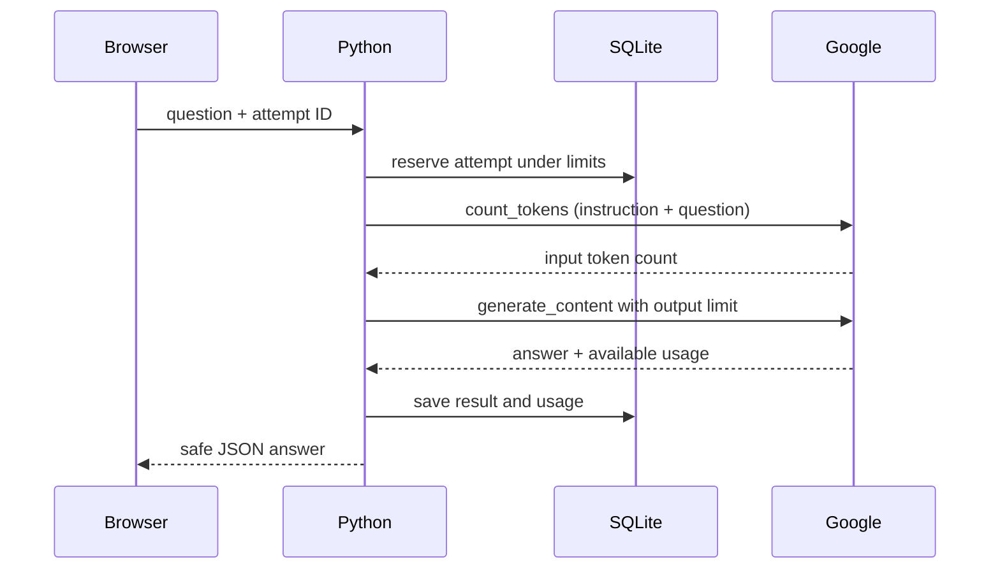

# M2: from a string to a real model request

The app now has nine complete lessons, a Google Cloud adapter, lesson-aware Ask AI, and explicit Demo / Google chatbot modes. Live access still needs your local credential setup and a successful real connection test. Offline lessons and games work immediately.

## Your next learning experiment

Open L07, Prompt Kitchen. Before running its Python example, predict what the three lines will print. Change its shopping-basket context to a lunchbox. The function assembles a string; it does not call an AI.

Play Prompt Recipe Mixer, then make your own prompt with three ingredients:

1. Task: explain a Python dictionary to a beginner.
2. Context: use a phone contacts list.
3. Output: two sentences and one key/value example.

Write a rubric before looking at an AI answer: does it explain lookup, use your context, and follow the format? This turns “that seems good” into a check you can repeat. L08 teaches the tutor’s job instruction; L09 traces the network journey.

## Connect your Google account

From the project directory, create the ignored server configuration:

```powershell
Copy-Item -LiteralPath .env.example -Destination .env
```

Run that command only if `.env` does not already exist. Edit the local file directly. Do not paste a key into a chat, frontend code, or a screenshot. OS environment settings override `.env` values.

For **Cloud express mode**, set `GOOGLE_AUTH_MODE=express_key`, fill `GOOGLE_CLOUD_API_KEY` with your Cloud express key, set `GOOGLE_MODEL` to a supported text model, and set `AI_ENABLED=true`. This is a Cloud key, not a Gemini Developer API / AI Studio key. The adapter uses the express Cloud endpoint without a project/region in the request path. See [Google’s express setup](https://docs.cloud.google.com/gemini-enterprise-agent-platform/models/start/express-mode/overview).

For **standard Google Cloud**, set `GOOGLE_AUTH_MODE=adc`, `GOOGLE_CLOUD_PROJECT`, `GOOGLE_CLOUD_LOCATION`, `GOOGLE_MODEL`, and `AI_ENABLED=true`. Configure local Application Default Credentials with `gcloud auth application-default login`. Your project needs the required API, billing, IAM access, and a supported model/location. The server obtains credentials through `google.auth.default`; it explicitly supplies them to the SDK. It does not use the express key in ADC mode. See [Google’s Cloud setup](https://docs.cloud.google.com/gemini-enterprise-agent-platform/models/start).

Standard Cloud API-key authentication is not implemented; choose express mode for an express key or ADC for a standard project. No model ID or pricing is assumed for your project.

Restart the Python server after editing configuration. Stop it with Ctrl+C in its terminal, then run `./run.ps1`. Open Settings and click **Test Google connection**. This explicitly makes a token-count request and one short generation request; charges may apply. “Configured” means fields exist. A successful real reply verifies access. A fake-provider test or the offline simulation cannot do that.

Choose **Google Cloud AI** on My chatbot and send your prompt recipe. Compare the answer against your rubric and record the actual result in the journal. Leave L09’s live build unfinished until you have completed this real experiment.

## Follow the code in small steps



The key authenticates the server’s transport. It is never an ingredient in the prompt.

| File | What to learn from it |
| --- | --- |
| `app/config.py` | Read local configuration without putting secrets in HTML |
| `app/main.py` | Map browser URLs to Python functions; sync routes run in FastAPI’s worker pool |
| `app/ai.py` | Select the current lesson, enforce limits, reserve an attempt, save its outcome |
| `app/providers.py` | Translate our request into Google SDK calls and redact failures |
| `app/db.py` | Append the request ledger without changing existing progress tables |
| `app/static/js/common.js` | Send tutor questions and preserve attempt IDs after lost responses |
| `app/static/js/chat.js` | Keep Demo and Google displays separate and preserve failed drafts |

Try reading `AIService.request()` as a checklist: choose context → validate configuration → reserve request → call adapter → record result. You do not need to understand every line at once.

## Understand memory and limits

Each M2 question is independent. Ask AI sends the selected lesson and current question. Chatbot requests send the current message and the chatbot instruction. Earlier displayed replies are not sent, and journals are not sent. Hint mode excludes our build reference solution; solution mode includes it. The model may still create a solution on its own, so this is guidance, not a guarantee. AI never awards XP or edits lessons.

The local app allows one active AI attempt, eight attempts/minute, and 50 attempts per UTC day. User input is limited to 4,000 characters. Counted input is capped at 6,000 tutor or 12,000 chat tokens; configured output limits are 1,024 tutor, 2,048 chat, and 128 connection-test tokens. A selected model must support these requests and token counting. There are no automatic SDK retries.

Usage shows attempts, model API calls attempted, reported tokens, and attempts with unknown usage. Count and generate are separate API calls. Failed calls, authentication failures, and missing metadata can leave usage uncertain. Reported total tokens can include tokens beyond the displayed answer. Cost is unknown; these limits do not guarantee a spending cap.

When a browser response is lost, retrying the same unchanged question reuses its saved attempt ID and can recover the cached result without a new provider call. A server-reported failure consumes its ID; an explicit retry creates a new attempt. After a server crash, running attempts become interrupted and are not silently rerun. Check usage before retrying an uncertain result.

Use one local server process; multi-worker hosting, streaming, saved conversations, and selected-history recall belong to M3 or later.

When Google reports MAX_TOKENS, the UI labels the answer as potentially incomplete. Returned usage on empty/blocked replies is retained; absent metadata remains unknown. No automatic continuation is sent.
