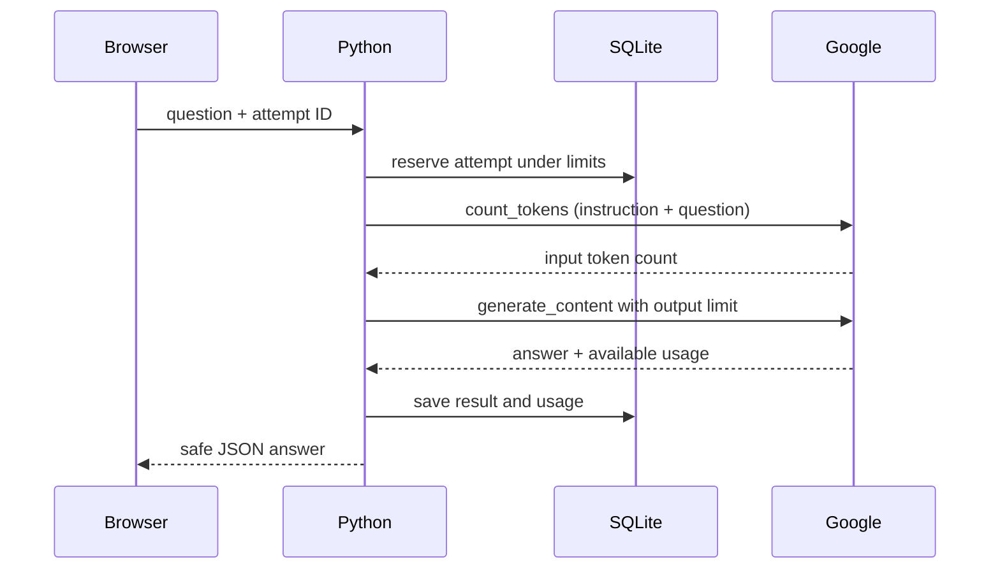

# M2: from a string to a real model request

The app now has nine complete lessons, a Google Cloud adapter, lesson-aware Ask AI, and explicit Demo / Google chatbot modes. Live access still needs your local credential setup and a successful real connection test. Offline lessons and games work immediately.

## Your next learning experiment

Open L07, Prompt Kitchen. Before running its Python example, predict what the three lines will print. Change its shopping-basket context to a lunchbox. The function assembles a string; it does not call an AI.

Play Prompt Recipe Mixer, then make your own prompt with three ingredients:

1. Task: explain a Python dictionary to a beginner.
2. Context: use a phone contacts list.
3. Output: two sentences and one key/value example.

Write a rubric before looking at an AI answer: does it explain lookup, use your context, and follow the format? This turns “that seems good” into a check you can repeat. L08 teaches the tutor’s job instruction; L09 traces the network journey.

## Connect your Google account

Open [Settings](http://127.0.0.1:8001/settings). For **Cloud express mode**, select Google Cloud express API key, paste your key in the password field, enter a text model ID supported by your account, enable Google AI, and click **Save connection**. The form takes effect immediately. A blank key field keeps an already saved key; pasting a new key replaces it.

The key goes to the local Python server and is encrypted for your Windows account using DPAPI in ignored `data/ai-settings.json`. It is never returned by the settings API, put in prompt context, or stored in browser drafts. The input is cleared after a successful save and when leaving the page. **Remove saved key** removes the stored credential and disables AI while keeping lessons, usage, and saved chats. Saving or removing makes no Google request. Processes running under the same Windows account can still access your protected key; this is local account protection, not an independent vault.

For **standard Google Cloud**, choose Standard Cloud · local ADC and enter project, location, and model in this same form. Configure local Application Default Credentials once using `gcloud auth application-default login`. The SDK receives those credentials explicitly and does not use a saved express key in this mode. Your project must have the required API, billing, permissions, and model/location access. Standard Cloud API-key authentication is not implemented; use an express key for express mode or ADC for a standard project. See [Google's express example](https://docs.cloud.google.com/vertex-ai/generative-ai/docs/samples/googlegenaisdk-vertexai-express-mode).

Click **Test Google connection** after saving. This makes a token-count request and one short generation request; charges may apply. “Configured” means fields exist. A real usable reply verifies access; fake tests and offline simulations cannot do that. Saving resets any earlier verified status, and connection changes are rejected while an AI request is active. No model ID or price is assumed for your account.

Google connection setup now uses this form exclusively. Legacy configuration files and AI environment variables are no longer read. Existing private files are left untouched; re-enter your connection in Settings once. The encrypted key survives a restart under the same Windows account. If the file is corrupt or cannot be decrypted, the app opens offline and invites you to save new settings.

Choose **Google Cloud AI** on My chatbot and send your prompt recipe. Compare the answer against your rubric and record the actual result in the journal. Leave L09’s live build unfinished until you have completed this real experiment.

## Follow the code in small steps

The key authenticates the server’s transport. It is never an ingredient in the prompt.

| File | What to learn from it |
| --- | --- |
| `app/config.py` / `app/settings_store.py` | Load Settings and protect the saved key without returning it in HTML |
| `app/main.py` | Map browser URLs to Python functions; sync routes run in FastAPI’s worker pool |
| `app/ai.py` | Select the current lesson, enforce limits, reserve an attempt, save its outcome |
| `app/providers.py` | Translate our request into Google SDK calls and redact failures |
| `app/db.py` | Append the request ledger without changing existing progress tables |
| `app/static/js/common.js` | Send tutor questions and preserve attempt IDs after lost responses |
| `app/static/js/chat.js` | Keep Demo and Google displays separate and preserve failed drafts |

Try reading `AIService.request()` as a checklist: choose context → validate configuration → reserve request → call adapter → record result. You do not need to understand every line at once.

## Understand memory and limits

Each M2 question is independent. Ask AI sends the selected lesson and current question. Chatbot requests send the current message and the chatbot instruction. Earlier displayed replies are not sent, and journals are not sent. Hint mode excludes our build reference solution; solution mode includes it. The model may still create a solution on its own, so this is guidance, not a guarantee. AI never awards XP or edits lessons.

The local app allows one active AI attempt, eight attempts/minute, and 50 attempts per UTC day. User input is limited to 4,000 characters. Counted input is capped at 6,000 tutor or 12,000 chat tokens; configured output limits are 1,024 tutor, 2,048 chat, and 128 connection-test tokens. A selected model must support these requests and token counting. There are no automatic SDK retries.

Usage shows attempts, model API calls attempted, reported tokens, and attempts with unknown usage. Count and generate are separate API calls. Failed calls, authentication failures, and missing metadata can leave usage uncertain. Reported total tokens can include tokens beyond the displayed answer. Cost is unknown; these limits do not guarantee a spending cap.

When a browser response is lost, retrying the same unchanged question reuses its saved attempt ID and can recover the cached result without a new provider call. A server-reported failure consumes its ID; an explicit retry creates a new attempt. After a server crash, running attempts become interrupted and are not silently rerun. Check usage before retrying an uncertain result.

Use one local server process; multi-worker hosting, streaming, saved conversations, and selected-history recall belong to M3 or later.

When Google reports MAX_TOKENS, the UI labels the answer as potentially incomplete. Returned usage on empty/blocked replies is retained; absent metadata remains unknown. No automatic continuation is sent.
