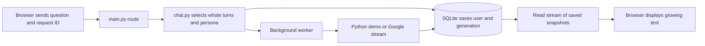

# M3: your small chatbot

You now have saved conversations, personas, streamed replies, Stop, explicit retry variants, and a conversation context inspector. Start with [My chatbot](http://127.0.0.1:8001/chat). L10–L12 explain these features through games and small Python examples.

Google configuration still uses [the M2 setup](M2_WALKTHROUGH.md). Demo is a local Python rehearsal with zero Google calls; it never claims to be a live model.

## A five-minute memory game

1. Choose Demo and New conversation. On a phone, expand **Your chats & persona**.
2. Give the chat a title, select Python coach, and save.
3. Send `My favorite fruit is mango.` Then ask `What was my favorite fruit earlier?`
4. The demo quotes your earlier message through a Python lookup. Inspect sent context on the follow-up: user, assistant, user.
5. Refresh. The conversation and persona reload from SQLite.
6. Open the conversation backpack and preview a draft. The saved database and the selected request context are different things.

If Google is configured, repeat in a separate Google conversation. Record the actual reply rather than assuming the model will always answer correctly.

## Streaming and stopping

Send a demo message and press Stop after the first text appears. The partial reply remains saved with a stopped status. Refresh to check it. It does not enter later context until you select **Use partial reply**.

**Try another reply** is an explicit new attempt. In Google mode it can incur another charge. **Recover saved reply** and refresh read the existing generation; they do not generate a replacement. If the server itself restarts, unfinished replies become interrupted and retain committed text.

An alternative complete reply stays alongside the selected reply. Choose **Use this reply** to change the latest turn's context. Earlier turns cannot be changed after follow-ups in this version; start a new chat to explore another branch. Archived chats can be restored without deletion.

Stop requests local cancellation and stops consuming the upstream stream when control returns. It cannot promise that Google has not already billed work. Usage after cancellation can be unknown.

## Follow one Python request

`ChatService.context()` in `app/chat.py` builds a Python list of role/text dictionaries. Each selected turn adds a user/assistant pair. The new user message goes last. The selection keeps at most ten recent pairs and uses UTF-8 bytes as a conservative heuristic. Google then counts actual input tokens before generating, with a 12,000 input limit and 2,048 output limit. These are app limits, not a currency spending guarantee.

`ChatService.start()` atomically saves the user turn, generation ID, and live usage reservation. Reusing the same operation ID returns the existing generation. `run()` persists text as chunks arrive; `cancel()` commits stopped status immediately so late chunks cannot overwrite it. Browser refresh reads the same generation snapshots.

`GoogleProvider.stream()` in `app/providers.py` maps the assistant role to Google's `model` role and sends explicit structured contents. It normalizes visible text, finish reasons, and reported usage. It excludes thought parts. The context inspector shows our inputs, never private model reasoning. The pinned SDK's stream behavior is tested without credentials using an HTTP mock. [Official SDK documentation](https://googleapis.github.io/python-genai/).

`app/static/js/chat.js` reads the stream using `fetch`, a UTF-8 decoder, and complete event frames. Full snapshots replace visible text, so reconnecting does not duplicate chunks. Text is rendered with `textContent`, including user and model replies. Completion is announced through a status region rather than announcing every chunk.

## Make one thing yours

First run L10's Python example. Change `turns[-1:]` to `turns[-2:]`. Predict whether the word mango will now enter the selected context, then run it. The database/list kept it all along; your selection changed what was sent.

For an app edit, change the Python coach's instruction string in `PERSONAS` in `app/chat.py` to ask for a shopping-basket example. Restart, save that persona in a chat, and preview the request. Demo can show the changed instruction but only a configured live model can respond to it. Existing attempt snapshots retain their original instructions.

Save your own observation in the Workshop journal. Do not mark a real Google experiment complete after only a demo or mock test.

## What comes next

M4 introduces embeddings and attention through explicitly labeled educational toys. Complete a real Google connection check when credentials are ready, then compare a live follow-up with the demo. See [M3 verification](M3_VALIDATION.md) for evidence and remaining limits.
