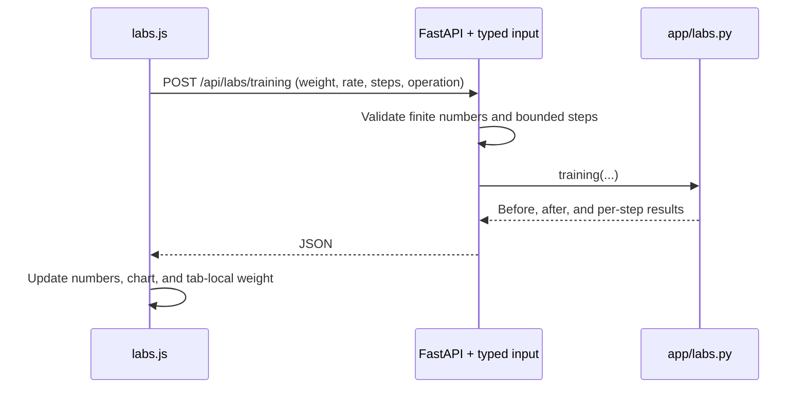

# M4: three ideas you can move

Open [Model Observatory](http://127.0.0.1:8001/observatory) after starting the app. Build links to it, and L13–L15 each link to their experiment. All three toys run in local Python without Google, a GPU, NumPy, or PyTorch.

These are teaching experiments: fruit features, attention scores, and scalar values are authored numbers. They do not inspect Gemini. The numeric training experiment has one parameter and no language ability. Ask AI still uses the separate lesson tutor when Google is configured.

## A playful 25-minute session

| Minutes | Experiment | Predict before acting |
| --- | --- | --- |
| 0–7 | L13 / Fruit vectors | Which fruit matches [0, 0, 10]? Does scaling Apple change direction? |
| 7–15 | L14 / Attention mixer | With query “it”, can the future word “tired” contribute under the mask? |
| 15–23 | L15 / Training gym | Will another training step improve the held-out check? |
| 23–25 | Journal | Explain one surprising result in two sentences. |

You can also study one lesson per session. Each has Learn, Play, Quiz, Build, a runnable Python example, and feedback for every choice. Moving sliders earns no XP; the existing lesson acknowledgments and scored practice keep their usual rules. Build completion remains your self-report.

## Fruit fingerprints: a vector is an ordered list

Our feature order is `[sweetness, crunch, sourness]`. Apple is `[7, 8, 3]`, Banana `[9, 2, 1]`, Lemon `[2, 1, 10]`. These are imaginary ratings from 0 to 10, not nutritional measurements.

Cosine compares directions: dot product divided by the two magnitudes. Magnitude uses the square root of summed squared features. Apple and half-Apple point the same way and have cosine 1. Raising just sourness changes direction. The zero vector has no direction, so the app displays **Undefined** and chooses no winner.

Try all-zero sliders, then `[0, 0, 10]`. Run L13's Python and change its scaled vector to `[7, 8, 6]`: the cosine is approximately 0.9716. Learned language embeddings also represent inputs numerically, but their dimensions are learned from data. Similarity alone does not establish identity or truth.

## Attention mixer: scores become a weighted mixture

The seven illustrative word positions have manual scores and authored scalar values. The query selector does not calculate learned query/key projections. It chooses which positions the mask allows.

Choose “it”, keep the causal mask on, and raise “tired” to 3. Its weight stays zero because it is later than the query. Choose the first word: only itself contributes. Turn the mask off to compare unrestricted mixing.

Python computes stable softmax by subtracting the largest allowed score before exponentiation. Allowed weights sum to 1; excluded positions have exactly zero weight. The result is `sum(weight * value)`. Lower Score softness makes unequal scores more concentrated. This control belongs to the toy and does not change chat sampling temperature.

Real attention uses learned representations within a larger architecture. A displayed weight is not proof of grammatical reference or private reasoning. The mask and weighted-mixture concepts follow [Attention Is All You Need](https://arxiv.org/abs/1706.03762); the toy's numbers and sentence were authored for this app.

## Training gym: inference reads; training updates

The complete numeric model is `prediction = weight * x`. Training uses only `(x=1, target=3)`. The held-out check is `(x=2, target=4)` and does not influence the gradient.

Start at weight 1, rate 0.25:

| Action | Weight | Training loss | Held-out loss |
| --- | --- | --- | --- |
| Predict only | 1 | 4 | 4 |
| Train once | 2 | 1 | 0 |
| Train again | 2.5 | 0.25 | 1 |
| Train again | 2.75 | 0.0625 | 2.25 |

For the training example, loss is `(weight - 3)**2` and its gradient is `2 * (weight - 3)`. The update subtracts `rate * gradient`. The first update is `1 - 0.25 * (-4) = 2`.

More training approaches weight 3. That fits the training example but predicts about 6 for the check's input 2. One parameter cannot fit both authored examples. This illustrates a model limitation; one held-out example does not certify generalization or prove all forms of overfitting.

Reset and set rate 1. Two training steps bounce `1 → 5 → 1`, both with training loss 4. Rate 0.25 settles in this particular quadratic; it is not a universal optimizer recommendation.

Controls and the precise weight survive a reload in the same browser tab, if session storage is available. The chart shows the last 13 states and the table the last 12 updates. Reload or a manual weight change starts a new history. Numbers are displayed rounded to four decimals, while updates retain full precision. A failed request keeps your weight available for retry.

## Follow one request through Python

Read [app/labs.py](../app/labs.py) first: the math is plain Python. [app/models.py](../app/models.py) defines valid inputs. [app/main.py](../app/main.py) connects them to routes. [labs.js](../app/static/js/labs.js) handles sliders, results, tabs, and temporary storage. No numeric route writes progress, chats, or Google usage.

Your small ownership task: run L15's example locally and change the rate from 0.25 to 1. Predict the first three weights, then verify them. Record your explanation in the journal. No need to alter the application API to try this.

Next planned milestone: M5, a curated note library with keyword retrieval and source-backed answers. Existing M2/M3 live Google gates still require your actual local credential setup and connection test.
