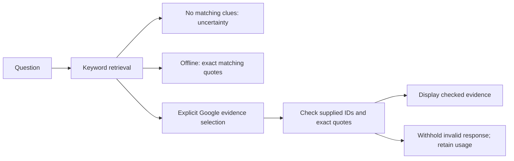

# M5: a notebook for your chatbot

Open [Knowledge Library](http://127.0.0.1:8001/library) in the running local app,
or choose **Build → Open the library** in the private cloud app. L16–L18 each
link to it. The lessons, search, source cards, and chunk preview work offline.
Your Google key stays in Settings.

Pip's café is fictional. Its four authored notes describe drinks, opening
times, a puzzle club, and board games. They make a small, inspectable library
for learning. No owner name is provided. Café coins are imaginary currency.

## A 25-minute detective session

| Minutes | Try | Explain what happened |
| --- | --- | --- |
| 0–7 | L16: split the practice note at 10 and 30 words | Which piece lost a subject or sentence boundary? |
| 7–15 | L17: Find clues for mango and Saturday | Which words matched, and which source ranked first? |
| 15–23 | L18: Show evidence, then ask who owns the café | What is supported, and what remains unknown? |
| 23–25 | Write a journal entry | Separate source fidelity from relevance and truth. |

Each lesson has reading, three game rounds, three quiz questions, a runnable
Python example, hints, and a build task. Library controls themselves award no
XP. Build acknowledgments remain your self-report. Each library question is
independent and does not read or modify saved chatbot conversations.

## Start with an index card

A **chunk** is a piece of a document that can be searched and supplied with a
question. `chunks()` first separates blank paragraphs, then splits long ones
into groups of at most 60 whitespace words. It preserves word order and
normalizes whitespace. It can cut a sentence; it is not a model tokenizer.

`N01-v1-p1-1` names note N01, version 1, paragraph 1, piece 1. Source links open
the note and focus the exact displayed piece. Keep a subject, value, and any
important condition together. A chunk that says only “4” cannot explain a price.

The practice splitter accepts 10–80 words per piece and at most 4,000 characters.
It sends the text only to this app's Python server, returns temporary pieces,
and saves nothing. It does not add notes to retrieval or send them to Google.
To revise the real library, edit [the curated notes](../content/library.json)
through your development prompts. Increase the affected note's version and
the library version, validate, then reload content or deploy. File uploads and
in-app note publishing are later features.

## Follow the search trail

Ask **Which drinks contain mango?**, then click **Find clues**. Search runs in
Python with no Google call:

1. Lowercase, remove accents, extract letters/numbers, and remove common words.
2. Apply a small explicit alias map, including `drinks → drink`.
3. Score each piece by the number of distinct shared query terms.
4. Keep positive scores, sort by descending score then source ID, and take three.

The inspector shows query terms, matched words, scores, and how many matches
were omitted. A score is a count, not confidence. Repeating a query word does
not add votes. The optional note filter narrows the search.

Mango Cloud, Mango Spark, and Mint Moon all match `drink` and `mango`. But Mint
Moon says it contains **no mango**. Read negation: a keyword match does not mean
the drink contains the ingredient. The same baseline can miss synonyms such
as “fruit smoothie.” Try Saturday with only the drinks note selected, then
with all notes, to distinguish missing evidence from a restrictive filter.

## Check the receipt before believing it

Offline **Show evidence** returns exact matching quotes and labels them clues,
not an AI answer. You decide whether they answer the question.

Optional **Google → Ask Google** sends the current question and up to three
retrieved chunks. It sends no journal, saved chat, whole library, or API key in
the prompt. Google selects evidence using a small JSON response:

```json
{"insufficient": false, "evidence": [{"source_id": "N01-v1-p1-1", "quote": "Exact whole chunk text"}]}
```

This illustrates the shape; the example's placeholder quote would fail the
real checker. Python requires the exact shape, at most three unique supplied
source IDs, and an entire quotation equal to its retrieved chunk. Invented
IDs, IDs from non-retrieved notes, altered quotes, extra factual-answer fields,
and truncated responses are withheld. Only checked source quotes are displayed.

This is a deliberately extractive first version. It does not display free-form
model paraphrases. A verified quote can still be irrelevant, incomplete,
contradictory, or based on a false note. The checks establish provenance and
quote fidelity; they cannot certify semantic support or real-world truth.

Ask **Who owns the café?** Common words are removed and `owns` finds no clue.
The app returns uncertainty with zero Google calls, even in Google mode. If
search finds chunks that do not support the requested information, Google is
instructed to return `insufficient: true` with an empty evidence list. A miss
does not establish that the requested fact is false.

Live selection shares the existing quota and request ledger: one active AI
request, 8 attempts/minute, 50/UTC day, actual Google input counting, a 12,000
input-token cap, and a 2,048 output-token cap. Failed source checking can still
incur charges; reported usage is retained. No automatic provider retry occurs.
A lost successful HTTP response can recover the same saved attempt without
another model call. A failed consumed attempt requires an explicit new attempt.

## Follow one Python request



[app/library.py](../app/library.py) owns splitting, ranking, and source checks.
[app/models.py](../app/models.py) bounds requests and validates curated notes.
[app/main.py](../app/main.py) connects the page and APIs.
[app/ai.py](../app/ai.py) owns the shared Google request policy, cache, and ledger.
The page uses [library.js](../app/static/js/library.js) to render text safely,
show the trace, and recover pending requests.

Your ownership task: run L17's Python example, extract a search function, and
add `recipe: mango ice`. Predict the score and tie order before running it.
Then explain why the same score is not the same as the same meaning.

Retrieval supplies external information to a model request; it does not train
the model. The [original RAG paper](https://arxiv.org/abs/2005.11401) combines a
learned retriever, external memory, and generation. Our keyword baseline and
exact-quote selector teach the request flow without reproducing that architecture.

Next: M6, a bounded tool sandbox, instruction-injection exercise, and repeatable
evaluation. Real Google evidence selection still needs your own explicit
connection test and a live comparison.
